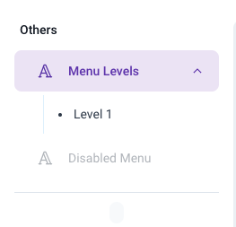

# [Layout](/src/layout/)

## [Header](/src/layout/MainLayout/Header/)

The Header consists of the following components:

1. [FullScreenSection](/src/layout/MainLayout/Header/FullScreenSection/)
2. [LocalizationSection](/src/layout/MainLayout/Header/LocalizationSection/)
3. [MobileSection](/src/layout/MainLayout/Header/MobileSection/): Collapsed Header view for mobile screens.
4. [NotificationSection](/src/layout/MainLayout/Header/NotificationSection/): Notifications are populated in [NotificationList.jsx](/src/layout/MainLayout/Header/NotificationSection/NotificationList.jsx)
5. [ProfileSection](/src/layout/MainLayout/Header/ProfileSection/)
6. [SearchSection](/src/layout/MainLayout/Header/SearchSection/): This component incorporates both the mobile view search bar and normal search bar.
7. [LogoSection](/src/layout/MainLayout/LogoSection/): This component imports the [Logo](/src/ui-component/Logo.jsx) component:
   - The Logo component currently displays an SVG with conditional fill colors dependant on the theme being used. An image can also imported and displayed instructions for which can be found in the [code file](/src/ui-component/Logo.jsx). The image source can also be conditionally changed dependant on the theme being used.

For usage see [index.jsx](/src/layout/MainLayout/Header/index.jsx)

## Menu

There is support of menu in both sidebar(vertical) and horizontal configurations depending on the theme config in [config.js](/src/config.js).

The menu status (closed or open) is saved as cache using SWR in [menu.js](/src/api/menu.js). This can be accessed as follows:

```
import { useGetMenuMaster } from 'api/menu';
   const { menuMaster } = useGetMenuMaster();
   const drawerOpen = menuMaster.isDashboardDrawerOpened; //boolean
```


Menu items are sourced from [menu-items](/src/menu-items/) and grouped in required components ([NavItem](/src/layout/MainLayout/MenuList/NavItem/), [NavGroup](/src/layout/MainLayout/MenuList/NavGroup/), [NavCollapse](/src/layout/MainLayout/MenuList/NavCollapse/)). Menu items are imported and bundled together in [index](/src/menu-items/index.jsx). 


Each menu item has the following attributes:
1. `id`
2. `title`: Title which is diplayed on the menu list. Current implementation wraps the title in a FormattedMessage component that replaced the title value with whatever is stored in the [locales](/src/utils/locales/) against the `id` passed.
3. `type`: Can be either `group`, `collapse` or `item`. 
   - `group`: Bundle components together in a group.
   - `collapse`: Collapse (hide) these components under the parent.
   - `item`: Show as individual item
4. `icon`
5. `url`: Url to redirect to once connected.
6. `disabled`: `true` or `false`


### Usage
```
const MenuItem = {
  id: "support",
  title: <FormattedMessage id="others" />,
  icon: icons.IconMenu,
  type: "group",
  children: [
    {
      id: "menu-level",
      title: <FormattedMessage id="menu-level" />,
      type: "collapse",
      icon: someIcon,
      children: [
        {
          id: "menu-level-1.1",
          title: (
            <>
              <FormattedMessage id="level" /> 1
            </>
          ),
          type: "item",
          url: "someUrlToRedirect",
        },
      ],
    },
    {
      id: "disabled-menu",
      title: <FormattedMessage id="disabled-menu" />,
      type: "item",
      url: "someUrlToRedirect",
      icon: someIcon,
      disabled: true,
    },
  ],
};
```

The above code will be rendered as:



To create your own menu items, follow the above structure in file in [menu-items](/src/menu-items/) and import in [index](/src/menu-items/index.jsx)

[MenuList](/src/layout/MainLayout/MenuList/) is wrapped in [HorizontalBar](/src/layout/MainLayout/HorizontalBar.jsx) or [SideBar](/src/layout/MainLayout/Sidebar/) depending on the orientation and displayed in [index](/src/layout/MainLayout/index.jsx)


---


[MainLayout](/src/layout/MainLayout/) is imported in [MainRoutes](/src/routes/MainRoutes.jsx) and used as the base of the webpage.

---
## [MinimalLayout](/src/layout/MinimalLayout/)

Blank pages with minimal elements such as Auth pages or maintanence pages are wrapped in MinimalLayout. Outlet here renders child routes. 