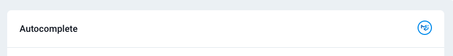
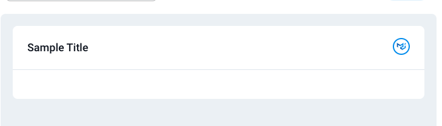
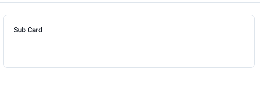

# [UI Components](/src/ui-component/)

This folder contains all the UI components used across the project such as cards, footers, maps and notifications.

## [Cards](/src/ui-component/cards/)

### [AuthSlider](/src/ui-component/cards/AuthSlider.jsx)

The `AuthSlider` component is a slider that displays a series of items, each containing a title and description. It uses the `react-slick` library to create the slider effect. Used in the [Reset Password page](/src/views/pages/authentication/ResetPassword.jsx)

### [AuthFooter](/src/ui-component/cards/AuthFooter.jsx)

The `AuthFooter` component is a simple footer that displays a link to `conradlabs.com`.

### [BackgroundPattern1](/src/ui-component/cards/BackgroundPattern1.jsx)

The `BackgroundPattern1` component used in the [Reset Password Page](/src/views/pages/authentication/ResetPassword.jsx) as the slider. It displays a SVG pattern that changes based on the current theme mode (light or dark).

### [CardSecondaryAction](/src/ui-component/cards/CardSecondaryAction.jsx)

The `CardSecondaryAction` component is a button that can be used as a secondary action for a card. It displays an icon and a tooltip with a title. When clicked, it opens a link in a new tab. For reference the button on the far right is the `CardSecondaryAction`:

### [MainCard](/src/ui-component/cards/MainCard.jsx)

The `MainCard` component is a custom card component that can be used as a wrapper for other components. It includes options for adding a title, secondary action, and custom styles. Empty Main Card looks like this:

### [RevenueCard](/src/ui-component/cards/RevenueCard.jsx)

The `RevenueCard` component is a card that displays revenue information, including a primary and secondary value, a label, and an icon.

Can be viewed in the app at: [base url]/widget

### [TotalIncomeLightCard](/src/ui-component/cards/TotalIncomeLightCard.jsx)

The `TotalIncomeLightCard` component is a card that displays total income information, including a value, a label, and an icon. It includes a loading state that displays a skeleton card while the data is being fetched.

Can be viewed in the app at: [base url]/widget

### [TotalIncomeDarkCard](/src/ui-component/cards/TotalIncomeDarkCard.jsx)

The `TotalIncomeDarkCard` component is a card that displays total income information, similar to the `TotalIncomeLightCard` component. However, it has a dark theme and includes a loading state that displays a skeleton card while the data is being fetched.

Can be viewed in the app at: [base url]/widget

### [SubCard](/src/ui-component/cards/SubCard.jsx)

The `SubCard` component is a custom card component that can be used as a wrapper for other components. It is similar to the `MainCard` component, but it has a different style and includes a dark title option. Empty SubCard:

### [FollowerCard](/src/ui-component/cards/FollowerCard.jsx)

The `FollowerCard` component is a card that displays information about a follower, including their avatar, name, location, and follow status. It also includes a menu with options for managing the follower. 

Can be viewed in the app at: [base url]/basic/cards

### [FriendsCard](/src/ui-component/cards/FriendsCard.jsx)

The `FriendsCard` component is a card that displays information about a friend, including their avatar, name, location, and options for messaging or video calling them. It also includes a menu with options for managing the friend.

Can be viewed in the app at: [base url]/basic/cards

### [UserDetailsCard](/src/ui-component/cards/UserDetailsCard.jsx)

The `UserDetailsCard` component is a card that displays detailed information about a user, including their avatar, name, role, about section, email, contact information, and location. It also includes options for messaging or blocking the user.

Can be viewed in the app at: [base url]/basic/cards

### [UserProfileCard](/src/ui-component/cards/UserProfileCard.jsx)

The `UserProfileCard` component is a card that displays information about a user, including their avatar, name, role, status, and social media links. It also includes an option for messaging the user.

Can be viewed in the app at: [base url]/basic/cards

### [UserSimpleCard](/src/ui-component/cards/UserSimpleCard.jsx)

The `UserSimpleCard` component is a card that displays basic information about a user, including their avatar, name, status, and social media links. It also includes a menu with options for editing or deleting the user.

Can be viewed in the app at: [base url]/basic/cards

## [Skeleton Cards](/src/ui-component/cards/Skeleton/)

The project includes several skeleton cards that can be used as placeholders while data is being fetched. These components use the `Skeleton` component from Material-UI to create the loading effect.

### [ImagePlaceholder](/src/ui-component/cards/Skeleton/ImagePlaceholder.jsx)

The `ImagePlaceholder` component is a skeleton card that can be used as a placeholder for an image.

### [EarningCard](/src/ui-component/cards/Skeleton/EarningCard.jsx)

The `EarningCard` component is a skeleton card that can be used as a placeholder for an earning card such as [EarningCard](/src/views/widget/EarningCard.jsx). It includes placeholders for the earning icon, title, and value.

Can be viewed in the app at: [base url]/advance/skeleton

### [PopularCard](/src/ui-component/cards/Skeleton/PopularCard.jsx)

The `PopularCard` component is a skeleton card that can be used as a placeholder for a popular card. It includes placeholders for the card title, image, and a list of popular items.

Can be viewed in the app at: [base url]/advance/skeleton

### [TotalGrowthBarChart](/src/ui-component/cards/Skeleton/TotalGrowthBarChart.jsx)

The `TotalGrowthBarChart` component is a skeleton card that can be used as a placeholder for a total growth bar chart. It includes placeholders for the chart title, filter options, and the chart itself.

Can be viewed in the app at: [base url]/advance/skeleton

### [TotalIncomeCard](/src/ui-component/cards/Skeleton/TotalIncomeCard.jsx)

The `TotalIncomeCard` component is a skeleton card that can be used as a placeholder for a total income card. It includes placeholders for the income icon, title, and value.

Can be viewed in the app at: [base url]/advance/skeleton

## [Extended](/src/ui-component/extended/)

### [`AnimateButton`](/src/ui-component/extended/AnimateButton.jsx)

The `AnimateButton` component is a higher-order component that adds animation to a button. It accepts several props that allow for customization of the animation type, direction, offset, and scale. The component uses the `motion` component from the `framer-motion` library to add animation to the button.

It takes the following as parameters:
1. `direction`: direction of motion/animation. Can be either `up`, `down`, `left` and `right`.
2. `type`: type of motion. Can be either `rotate`, `slide` or `scale`.

Example usage can be found in [Button](/src/views/forms/components/Button.jsx)

### [`Accordion`](/src/ui-component/extended/Accordion.jsx)

The `Accordion` component is a customizable accordion component that can be used to display a list of items with expandable content. It accepts several props that allow for customization of the data, default expanded item, expand icon, square style, and toggle behavior. The component uses the `Accordion` component from Material-UI to render the accordion.

Usage can be seen in [UIAccordion](/src/views/ui-elements/basic/UIAccordion.jsx)
Component can be viewed in app at [base url]/basic/accordion

### [`Avatar`](/src/ui-component/extended/Avatar.jsx)

The `Avatar` component is a customizable avatar component that can be used to display user profile pictures. The component uses the `Avatar` component from Material-UI to render the avatar. 

Example usage can be found at [UserDetailsCard](/src/ui-component/cards/UserDetailsCard.jsx)

### [`Chip`](/src/ui-component/extended/Chip.jsx)

The `Chip` component is a customizable chip component that can be used to display labels or tags. It accepts several props that allow for customization of the chip color, variant, and disabled state. It swtiches its colour based on the categories of colours which are defined in [Chip](/src/ui-component/extended/Chip.jsx) The component uses the `Chip` component from Material-UI to render the chip.

Example usage can be found at [NotificationList](/src/layout/MainLayout/Header/NotificationSection/NotificationList.jsx)

### [`Breadcrumbs`](/src/ui-component/extended/Breadcrumbs.jsx)

The `Breadcrumbs` component is a customizable breadcrumbs component that can be used to display the current location within a website. It accepts several props that allow for customization of the card style, custom location, divider, heading, icon, icons, links, max items, right alignment, separator, title, and title bottom position. The component uses the `Breadcrumbs` component from Material-UI to render the breadcrumbs.

Rendered Component can be viewed at [base url]/basic/breadcrumb

### [`Snackbar`](/src/ui-component/extended/Snackbar.jsx)

The `Snackbar` component is a customizable snackbar component that can be used to display notifications to the user. You can customize the snackbar properties using the [Snack Bar store](/src/store/slices/snackbar.js). The component uses the `Snackbar` component from Material-UI to render the snackbar. The snackbar component is wrapped around all the routes in [App](/src/App.jsx).

Rendered Component can be viewed at [base url]/advance/snackbar
Example usage can be found at [UISnakbar](/src/views/ui-elements/advance/UISnackbar.jsx)

###### Flow: 
Alerts originate from the [store](/src/store/slices/snackbar.js). The openSnackbar action is dispatched with the relevant payload and triggers the [Snackbar](/src/ui-component/extended/Snackbar.jsx) to display the alert.

### [`Transitions`](/src/ui-component/extended/Transitions.jsx)

The `Transitions` component is a customizable transitions component that can be used to add animation to elements. It accepts several props that allow for customization of the transition type, position, and direction. The component uses the `Collapse`, `Fade`, `Grow`, `Slide`, and `Zoom` components from Material-UI to render the transitions.

Example Usage can be seen in [Localization](/src/layout/MainLayout/Header/LocalizationSection/index.jsx) which renders the localization menu in the header. 

### NotiStack

This directory implements the stackable [notistack](https://notistack.com/) notification library with several customizations. 

Example Usage can be seen at [UISnackbar](/src/views/ui-elements/advance/UISnackbar.jsx)

Rendered Components can be seen at: [base url]/advance/snackbar

#### [`CustomComponent`](/src/ui-component/extended/notistack/CustomComponent.jsx)

The `CustomComponent` component is a custom snackbar component that displays a card with a message and an expandable section. It uses the `enqueueSnackbar` function from the `notistack` library to display the snackbar.

#### [`ColorVariants`](/src/ui-component/extended/notistack/ColorVariants.jsx)

The `ColorVariants` component displays a set of buttons with different color variants. It uses the `enqueueSnackbar` function from the `notistack` library to display a snackbar with the selected color variant.

#### [`HideDuration`](/src/ui-component/extended/notistack/HideDuration.jsx)

The `HideDuration` component displays a slider that allows the user to set the duration for which a snackbar is displayed. It uses the `enqueueSnackbar` function from the `notistack` library to display a snackbar with the selected duration.

#### [`DismissSnackBar`](/src/ui-component/extended/notistack/DismissSnackBar.jsx)

The `DismissSnackBar` component displays a set of buttons that allow the user to simulate a connection loss and then reconnect. It uses the `enqueueSnackbar` and `closeSnackbar` functions from the `notistack` library to display and dismiss the snackbar.

#### [`Dense`](/src/ui-component/extended/notistack/Dense.jsx)

The `Dense` component displays a checkbox that allows the user to enable or disable dense margins for snackbars. It uses the `enqueueSnackbar` function from the `notistack` library to display a snackbar with the selected margin setting.

#### [`IconVariants`](/src/ui-component/extended/notistack/IconVariants.jsx)

The `IconVariants` component displays a set of radio buttons that allow the user to select an icon variant for snackbars. It uses the `enqueueSnackbar` function from the `notistack` library to display a snackbar with the selected icon variant.

#### [`MaxSnackbar`](/src/ui-component/extended/notistack/MaxSnackbar.jsx)

The `MaxSnackbar` component displays a set of buttons that allow the user to set the maximum number of snackbars that can be displayed at once. It uses the `enqueueSnackbar` function from the `notistack` library to display snackbars with the selected maximum number.

#### [`PositioningSnackbar`](/src/ui-component/extended/notistack/PositioningSnackbar.jsx)

The `PositioningSnackbar` component displays a set of buttons that allow the user to display snackbars at different positions on the screen. It uses the `enqueueSnackbar` function from the `notistack` library to display snackbars at the selected position.

#### [`PreventDuplicate`](/src/ui-component/extended/notistack/PreventDuplicate.jsx)

The `PreventDuplicate` component displays a checkbox that allows the user to enable or disable duplicate snackbar prevention. It uses the `enqueueSnackbar` function from the `notistack` library to display snackbars with the selected duplicate prevention setting.

#### [`TransitionBar`](/src/ui-component/extended/notistack/TransitionBar.jsx)

The `TransitionBar` component displays a set of radio buttons that allow the user to select a transition animation for snackbars. It uses the `enqueueSnackbar` function from the `notistack` library to display snackbars with the selected transition animation.

#### [`SnackBarAction`](/src/ui-component/extended/notistack/SnackBarAction.jsx)

The `SnackBarAction` component displays a button that displays a snackbar with action buttons. It uses the `enqueueSnackbar` and `closeSnackbar` functions from the `notistack` library to display and dismiss the snackbar.

### [Forms](/src/ui-component/extended/Form/)

#### `FormControl`

The `FormControl` component is a customizable form control component that can be used to display input fields with labels, icons, and adornments. It accepts several props that allow for customization of the caption label, form state, primary and secondary icons, placeholder, and primary and secondary text. The component uses the `InputLabel`, `OutlinedInput`, and `InputAdornment` components from Material-UI to render the form control.

Example Usage can be found at [TextField](/src/views/forms/components/TextField.jsx)

Rendered component can be found at [base url]/components/text-field

#### [`FormControlSelect`](/src/views/forms/components/TextField.jsx)

The `FormControlSelect` component is a customizable form control component that can be used to display a select input field with labels, icons, and adornments. It accepts several props that allow for customization of the caption label, currencies, form state, primary and secondary icons, selected value, and primary and secondary text. The component uses the `TextField`, `MenuItem`, and `InputAdornment` components from Material-UI to render the form control.

Example Usage can be found at [TextField](/src/views/forms/components/TextField.jsx)

Rendered component can be found at [base url]/components/text-field

#### [`InputLabel`](/src/ui-component/extended/Form/InputLabel.jsx)

The `InputLabel` component is a customizable input label component that can be used to display labels for input fields. It accepts several props that allow for customization of the horizontal alignment of the label. The component uses the `InputLabel` component from Material-UI to render the label.

Example Usage can be found at [ActionBar](/src/views/forms/layouts/ActionBar.jsx)

Rendered component can be found at [base url]/forms/layouts/action-bar